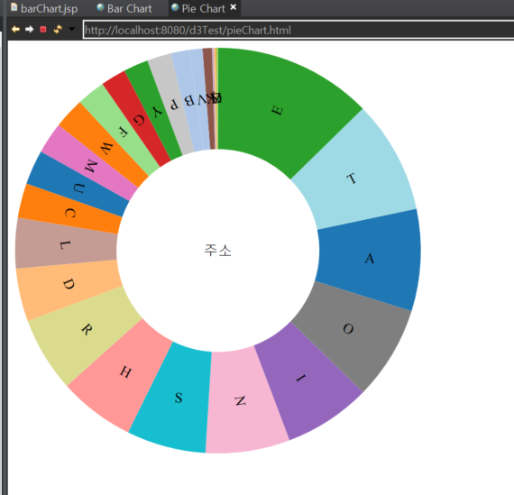

1. 시각화 페이지 개발
   - 차트 데이터 인터페이스 작성(완료)
   - d3.js CDN 이용 (완료)
   - 메인 화면에서 4개의 차트 설정(완료)
     - Bar(완료)
     - Line (완료)
     - Pie (수정 중)
     - scatter (공사 중)
   - 차트 데이터를 Restful 방식으로 요청(완료)
   - JSON Object Type으로 차트 데이터 응답(완료)
   - 데이터를 가져올 수 없을 시 공사 중 이미지 출력(완료)
   
2. 오류 사항
   
   - 차트 데이터 가이드 작성 방식이 맞는지 궁금합니다.
   - 이클립스와 git repository의 폴더와 연동 방법이 없는지 궁금합니다.
     - ex) github.com/jeonsanggi/DataVisualization/2주차/   는 A 프로젝트
     - ex) github.com/jeonsanggi/DataVisualization/3주차/   는 B 프로젝트
   
   - pie 차트 사용 중 잘림 문제
     - 이클립스 브라우저에서는 제대로 나오지만 크롬에서는 잘림
     - 코드 : [https://github.com/jeonsanggi/DataVisualization/blob/master/2%EC%A3%BC%EC%B0%A8/d3Test/WebContent/pieChart.html](https://github.com/jeonsanggi/DataVisualization/blob/master/2주차/d3Test/WebContent/pieChart.html)
     - 이클립스 화면
       - 
     - 브라우저 화면
       - 