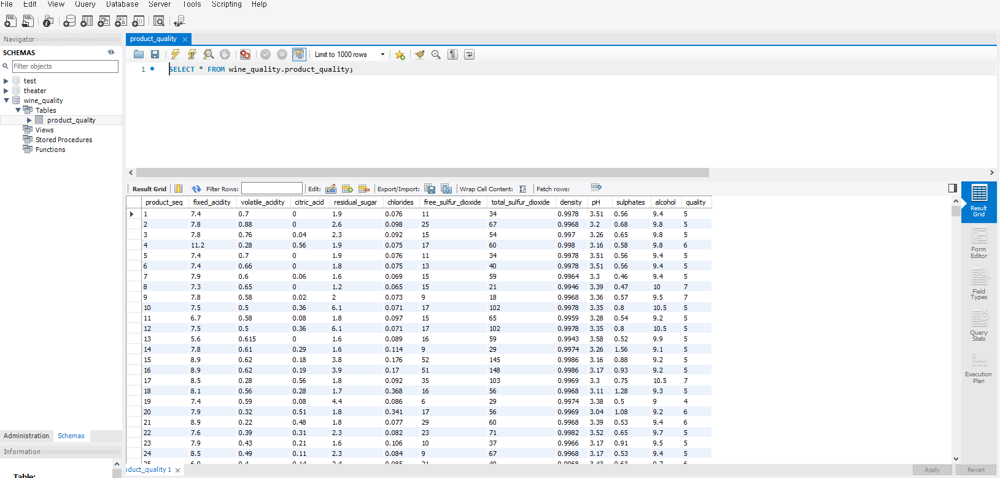
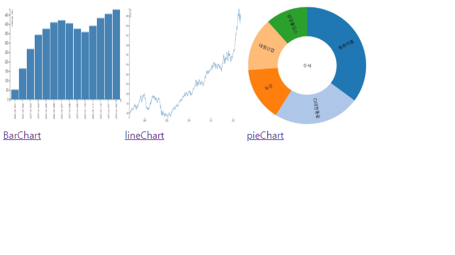
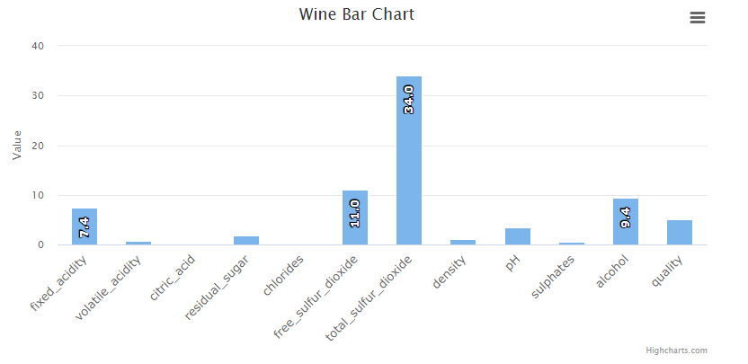
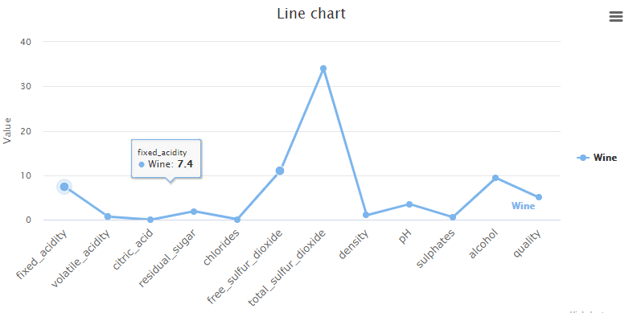
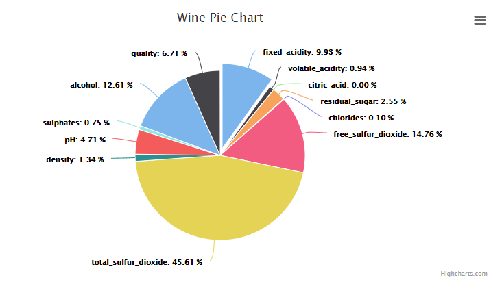

### 1. 품질 데이터 시각화 페이지

- HighChart를 이용한 Wine 품질 데이터 시각화 페이지 구축
  - Bar Chart (구현)
  - Line Chart (구현)
  - Pie Chart (구현)
- 데이터베이스

- 메인화면 (Home)

- Bar Chart

- Line Chart

- Pie Chart

### 2. 질문사항

1. 은행 (국민, IBK 등)의 전산분야에 취직 하기 위해 필요한 역량이 어떠한 것이 있을지 궁금합니다.
2. 서버 개발 직무를 수행하며 생길수 있는 대표적인 트러블슈팅 이슈 같은게 무엇이 있는지 궁금합니다.
3. 개발 해보면 좋을거 같은 프로젝트 종류를 추천해주시면 감사하겠습니다.